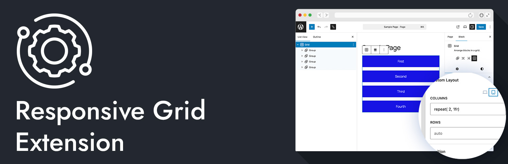

# Responsive Grid Extension



[](https://wordpress.org/)
[](https://www.php.net/)
[](https://github.com/bob-moore/Responsive-Grid-Extension/releases/latest)
[](https://www.gnu.org/licenses/gpl-2.0.html)

[](https://github.com/bob-moore/Responsive-Grid-Extension/actions/workflows/lint-css.yml)
[](https://github.com/bob-moore/Responsive-Grid-Extension/actions/workflows/lint-js.yml)
[](https://github.com/bob-moore/Responsive-Grid-Extension/actions/workflows/lint-php.yml)

Want to give it a test drive? Try it in the WP Playground: [](https://playground.wordpress.net/?blueprint-url=https://raw.githubusercontent.com/bob-moore/Responsive-Grid-Extension/main/_playground/blueprint-github.json)

Add responsive column and row controls to the WordPress Group block (`core/group`) when it uses Grid layout.

## Features

- Adds responsive grid controls to `core/group` in the block inspector.
- Lets you set grid template columns for desktop, tablet, and mobile.
- Lets you set grid template rows for desktop, tablet, and mobile.
- Keeps the native Group block workflow instead of introducing a custom block.
- Outputs responsive classes and CSS custom properties on the rendered block.
- Loads frontend styles only when a rendered Grid Group block needs them.
- Ships with GitHub-based plugin updates in the WordPress admin update UI.

## Requirements

- WordPress 6.7+
- PHP 8.2+

## Installation

### Install as a plugin

1. Download the latest release zip from GitHub releases.
2. In WordPress admin, go to Plugins -> Add New Plugin -> Upload Plugin.
3. Upload the zip and activate Responsive Grid Extension.

### Install via Composer (library usage)

If you are embedding this into your own project:

```bash
composer require bmd/responsive-grid-extension
```

Then bootstrap:

```php
use Bmd\ResponsiveGridExtension\Plugin;

$dependency_url  = plugin_dir_url( __FILE__ ) . 'vendor/bmd/responsive-grid-extension/';
$dependency_path = plugin_dir_path( __FILE__ ) . 'vendor/bmd/responsive-grid-extension/';

$plugin = new Plugin(
    $dependency_url,
    $dependency_path
);

$plugin->mount();
```

The `Plugin` constructor expects the URL and filesystem path to the Responsive Grid Extension dependency root, not the file where you call it. For example, pass `/path/to/vendor/bmd/responsive-grid-extension/` and the matching public URL for that directory.

## Usage

1. Add a Group block.
2. Set the Group block layout type to Grid.
3. Open the block sidebar.
4. Set custom grid template columns or rows for each device size.
5. Save and view the post.

Example values:

- Columns: `repeat(3, 1fr)`
- Columns: `2fr 1fr`
- Rows: `auto auto`
- Rows: `minmax(120px, auto) 1fr`

## Updates

This plugin is distributed through GitHub releases (not WordPress.org). The plugin includes a scoped GitHub updater so WordPress can detect and apply new versions from this repository.

## Changelog

### 0.1.5

- Refined the PHP plugin architecture around a dedicated bootstrapper, plugin service, and utility helper.
- Updated Composer autoloading for the new `Bmd\ResponsiveGridExtension` namespace structure.
- Renamed the standalone plugin entrypoint to `responsive-grid-extension.php`.
- Added separate GitHub Actions lint workflows for CSS, JS, and PHP.
- Optimized frontend asset loading so responsive grid styles enqueue only when a rendered Grid Group block is present.
- Rebuilt scoped updater dependencies.

### 0.1.4

- Added scoped GitHub updater bootstrap using `bmd/github-wp-updater` from `vendor/scoped`.
- Added Copilot instruction baselines under `.github/` for scoped updater install and production release packaging workflows.

### 0.1.3

- Introduced a basic plugin interface defining the `mount()`, `setUrl()`, and `setPath()` contract.
- Constructor accepts optional URL and path parameters for flexible asset resolution when used as a Composer dependency.
- Plugin bootstrap is wrapped in a named function.

### 0.1.2

- Added `mount()` method to register all WordPress hooks in one call.
- Simplified plugin bootstrap.

### 0.1.1

- Moved the main class into `inc/` for Composer PSR-4 autoloading.
- Fixed asset path resolution after directory restructure.

### 0.1.0

- Initial release.
- Added responsive Group block grid extensions for columns and rows.
